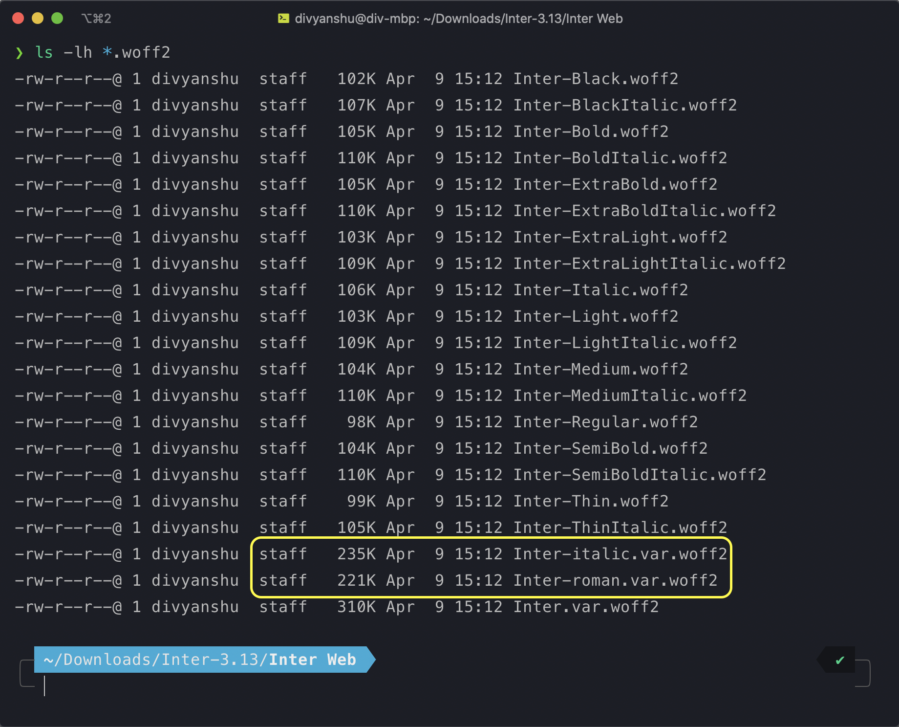

Variable fonts are pretty amazing. Conventionally, we use different font files for different weights, width or style. With this approach, you may end up with a lot of fonts that your users will end up downloading, for example _bold_, _italic_, _light_, _thin_, _regular_, _semibold_, _black_, etc. Alternatively, you can use **variable fonts** which can store all these font variants and more in a single font file with a much smaller payload size.

## Cost of fonts

Cost of parsing fonts is not as much as [cost of similarly sized JavaScript](https://developers.google.com/web/fundamentals/performance/optimizing-content-efficiency/javascript-startup-optimization#parsecompile). However, it's **still data that needs to be downloaded by your user**. Consider the sizes of different variants of the [Inter font](https://rsms.me/inter/).



The above image showcases file sizes of different font variants. The variable font `Inter-roman.var.woff2` has a size of 221KB and the italic variant of the variable font `Inter-italic.var.woff2` has a size of 235KB. Other files are different non variable variants of Inter font with approx size range of 100KB to 110KB.

1. **Individually**, variable fonts (highlighted in yellow) are **larger in size** compared to non-variable fonts.
1. However, if your application uses three or more variants of the font, variable fonts would be **effectively smaller** in **total size**. It's quite common to have around 5 or more variants (depending on your design) where this saving can be even more beneficial.

## Using variable fonts

Variable fonts can be used in the same manner as conventional fonts using a [`@font-face`](https://developer.mozilla.org/en-US/docs/Web/CSS/@font-face) rule:

```css
/* font declaration */
@font-face {
	font-family: 'Inter';
	font-weight: 100 900;
	font-display: swap;
	font-style: normal;
	font-named-instance: 'Regular';
	src: url('/fonts/Inter-roman.var.woff2') format('woff2');
}

/* font usage */
:root {
	font-family: 'Inter';
}
```

## Supporting older browsers

Like with all modern web technologies, [not all browsers support](https://developer.mozilla.org/en-US/docs/Web/CSS/font-variation-settings#Browser_compatibility) them (_hello IE_). Also, not all of your users might be using latest browsers or OS versions (older OS versions don't support variable fonts out of the box).

But we can work around that by adding fallback fonts for older browsers using [`@supports`](https://developer.mozilla.org/en-US/docs/Web/CSS/@supports) rule on [`font-variation-settings`](https://developer.mozilla.org/en-US/docs/Web/CSS/font-variation-settings) (which can be used to detect support for variable fonts):

```css
/* font declarations */
/* highlight-starts */
@supports not (font-variation-settings: normal) {
	@font-face {
		font-family: 'Inter';
		font-display: swap;
		src: url('/fonts/Inter-Regular.woff2') format('woff2'), url('/fonts/Inter-Regular.woff')
				format('woff');
	}
}
/* highlight-ends */

/* highlight-starts */
@supports (font-variation-settings: normal) {
	/* highlight-ends */
	@font-face {
		font-family: 'Inter';
		font-weight: 100 900;
		font-display: swap;
		font-style: normal;
		font-named-instance: 'Regular';
		src: url('/fonts/Inter-roman.var.woff2') format('woff2');
	}
	/* highlight-starts */
}
/* highlight-ends */

/* font usage */
:root {
	font-family: 'Inter'; /* we can still use the same font family name */
}
```

Great, now the browser would download a regular variant of the font on unsupported browsers and the variable variant only on supported browsers. I've added only a single fallback font, but you could add more variants depending on your usecase. Also, the `@supports not` for non variable font variant is not needed but without it latest browsers would end up downloading the non variable font variant as well which can be avoided.

## Alternative usage

Across the internet I've seen some articles putting the font usage selector inside `@supports`. With reference to the above example the usage would look something like this:

```css
:root {
	/* referencing the non variable variant for older browsers */
	font-family: 'Inter';
}

@supports (font-variation-settings: normal) {
	:root {
		font-family: 'Inter var';
	}
}
```

I prefer the previous approach of putting the `@font-face` rule inside `@supports` so I can refer to the same `font-family` in all my CSS selectors or design components.

## A few more tips

- You don't need to gzip your fonts if you're using modern formats such as `woff` or `woff2` since they're already efficiently compressed.
- I'm using `font-display: swap` in above examples so the text is rendered on the browser much faster (even before the font has downloaded). I find it better for my usecase since the user can read the content instantly (especially helpful in slower networks).

## Further reading

This was a concise post focusing mostly on variable fonts usage but there are lots of great articles on the internet you may find helpful which dive deeper on other aspects:

- [Introduction to variable fonts](https://web.dev/variable-fonts/)
- [Variable fonts guide on MDN](https://developer.mozilla.org/en-US/docs/Web/CSS/CSS_Fonts/Variable_Fonts_Guide)
- [Web font optimization guide](https://developers.google.com/web/fundamentals/performance/optimizing-content-efficiency/webfont-optimization#top_of_page)
